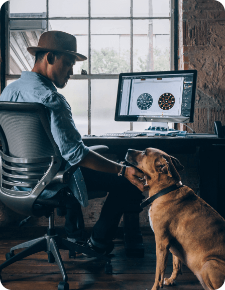

# Alp Toker - Personal Portfolio

Welcome to my personal portfolio website! This modern, responsive portfolio showcases my work as a Full Stack Developer and highlights my experience in creating elegant and efficient solutions.



## Features

- **Modern Design**: Clean and professional UI with smooth animations
- **Responsive Layout**: Seamless experience across all devices
- **Interactive Sections**: 
  - Dynamic Hero section
  - Project showcase with hover effects
  - Blog section with latest articles
  - Contact form for easy communication
- **Smooth Animations**: GSAP-powered animations for enhanced user experience
- **Mobile-First Approach**: Optimized for all screen sizes with a custom mobile menu

## Technologies Used

### Frontend
- **Next.js 14**: React framework for production
- **React**: UI component library
- **Tailwind CSS**: Utility-first CSS framework for styling
- **GSAP**: Professional-grade animation library
- **Next/Image**: Optimized image loading and rendering
- **Next/Font**: Custom font optimization

### Development Tools
- **ESLint**: Code linting
- **Prettier**: Code formatting
- **Git**: Version control
- **npm**: Package management

## Getting Started

1. **Clone the repository**
   ```bash
   git clone https://github.com/yourusername/alpport.git
   ```

2. **Install dependencies**
   ```bash
   npm install
   ```

3. **Run the development server**
   ```bash
   npm run dev
   ```

4. **Open your browser**
   Navigate to [http://localhost:3000](http://localhost:3000)

## Project Structure

```
alpport/
├── app/                  # Next.js app directory
├── components/          # React components
│   ├── homecomponents/  # Homepage-specific components
│   └── ...             # Other components
├── public/             # Static assets
│   ├── assets/         # Images, icons, etc.
│   └── ...
└── styles/            # Global styles
```

## Responsive Design

The portfolio is fully responsive and tested on:
- Mobile devices (320px and up)
- Tablets (768px and up)
- Desktops (1024px and up)
- Large screens (1440px and up)

## Customization

You can customize various aspects of the portfolio:
- Color schemes in `tailwind.config.js`
- Component styles in their respective files
- Content in the component files
- Animations in the GSAP configuration

## Contact

Feel free to reach out to me:
- Email: tokeralp@gmail.com
- [LinkedIn](#)
- [GitHub](#)

## License

This project is licensed under the MIT License - see the [LICENSE.md](LICENSE.md) file for details.

---

Built with by Alp Toker
